# Courierust - [中文文档](README_CN.md)

<p align="center">
  
</p>

> A self-contained HTTP/1.1 + HTTP/2 + HTTP/3 + WebSocket + gRPC protocol stack with zero third-party dependencies.

> Hands-on tutorials (English & 中文) live on the [wiki](https://github.com/blueokanna/Courierust/wiki).

The protocol core (`courierust_http` / `courierust_hpack` / `courierust_h2` / `courierust_ws` / `courierust_deflate` / `courierust_quic` / `courierust_h3` / `courierust_fingerprint` / `courierust_crypto` / `courierust_bytes` / `courierust_io`) compiles under `no_std + alloc` with **no dependencies at all**. The `std` feature (on by default) layers the threaded networking on top: a work-stealing thread pool, TCP adapters, the client (HTTP/1.1 pool, HTTP/2 and HTTP/3 drivers, WebSocket), the server (event-driven scheduler + WebSocket upgrade), and gRPC.

None of this wraps an existing library. Frame codecs, HPACK/QPACK header compression, QUIC packet protection, the WebSocket framing/masking/DEFLATE path, the stream state machine, flow control, priority scheduling, and fingerprint construction are all implemented from scratch, with no dependency on another HTTP stack.

## Why

The mainstream Rust HTTP ecosystem (hyper / h2 / h3 and friends) is excellent, but the dependency trees run deep, and things like `no_std` support, core affinity, and "what does this client look like to a server" are left as your problem. This crate is built around three constraints:

- **The protocol layer never touches `std`.** `std` only provides threads, TCP, and clocks.
- **Multi-core is explicit — within the model.** Server connections are dispatched through a work-stealing pool, and an **event-driven scheduler** (default on every platform) parks idle/partial plain-HTTP connections on a readiness poller so a herd of keep-alive / SSE / slow-loris connections cannot consume workers. Client pools are shared by authority, and HTTP/2 requests are multiplexed by a dedicated driver per connection; set `max_connections_per_host` when independent connections are needed for load distribution. Worker occupancy is **per connection**: a single HTTP/2 connection with many streams (or a slow stream, or SSE) holds exactly one server worker, so a connection's streams never multiply worker usage and never block each other.
- **The wire details follow the RFCs and are verified against published test vectors**, not just enough to pass a smoke test.

## Features

### Protocol core (no_std + alloc, zero deps)

- **HTTP/1.1**: request/response parsing and serialization, keep-alive, chunked transfer, `100-continue` handling.
- **HTTP/2 (RFC 9113)**:
  - Full frame codec (DATA / HEADERS / PRIORITY / RST_STREAM / SETTINGS / PUSH_PROMISE / PING / GOAWAY / WINDOW_UPDATE / CONTINUATION);
  - Per-stream and connection-level flow control, windows advanced per frame;
  - Stream state machine following §5.1 strictly — illegal transitions end in `PROTOCOL_ERROR`;
  - Stream priorities (RFC 9218): parses the `Priority` header and `PRIORITY_UPDATE` frames (type `0x10`), backed by the built-in **WUCS scheduler** (below).
- **HPACK (RFC 7541)**:
  - 61-entry static table + dynamic table + hash-accelerated index lookups;
  - 8-bit two-level table-driven Huffman decode (built at compile time), fast path for short codes;
  - Byte-for-byte verified against the official RFC C.2–C.6 vectors.
- **Fingerprints**:
  - `TlsProfile` describes the parameters of a TLS ClientHello; includes self-contained MD5 / SHA-256 (no deps);
  - **JA3**: `ja3_hash()` produces the standard 32-hex-digit fingerprint, matching the published Chrome record;
  - **JA4**: `ja4()` produces the four-part `t13d1516h2_…` fingerprint, matching the spec example;
  - **Chrome HTTP/2 fingerprint**: SETTINGS entries, initial `WINDOW_UPDATE`, frame order, and header ordering all mirror Chrome behavior, ready to feed to an external TLS layer.

### std networking layer

- **Work-stealing thread pool** (`courierust_pool`): per-worker LIFO cache + global FIFO steal queue; jobs can spawn jobs; stealing prefers the worker idle the longest.
- **Client** (`courierust_client`):
  - HTTP/1.1 keep-alive connection pool grouped by authority with bounded reuse;
  - HTTP/2 connections multiplex streams through dedicated drivers and can be capped per authority;
  - Redirect following (301/302/303 → GET), timeouts, `User-Agent`, etc.
- **Server** (`courierust_server`): by default an **event-driven scheduler** accepts, classifies (TLS / h2 / h1 from the first bytes), and parks idle plain-HTTP connections on a readiness poller (Winsock `select` / POSIX `poll`), handing ready ones to event workers in batches. TLS and HTTP/2 connections run on the blocking work-stealing pool. Setting `event_driven: false` restores the legacy one-pool-job-per-connection model for comparison.
- **WebSocket** (`courierust_ws` plus the server and client integrations): RFC 6455 framing, masking, UTF-8 validation, the opening handshake, fragmentation reassembly, the close handshake, and RFC 7692 `permessage-deflate` — from scratch. The server upgrades a live HTTP/1.1 connection from the handler hook (`Handler::websocket` → `WsService` + `WsConfig`: Origin policy, subprotocols, frame/message/fragment caps, a bounded send queue, Ping/Pong keepalive), and the upgrade works in **both** drivers — in the event reactor an idle WebSocket costs a poller slot instead of a thread. The client is `courierust_client::ws::WebSocket` over `ws://` and `wss://` (through the crate's own TLS). Engine details, deployment recipes and the honest benchmark rows: [`src/courierust_ws/README.md`](src/courierust_ws/README.md) and [`benches/WS_BENCHMARK.md`](benches/WS_BENCHMARK.md).
- **gRPC** (`courierust_grpc`): HTTP/2 + length-prefixed message framing + `grpc-status` / `grpc-message` handling, with unary, server-streaming, client-streaming and bidi calls on both sides. `gzip` message compression is implemented from scratch (RFC 1951/1952: full DEFLATE decompression for any producer, fixed-Huffman LZ77 compression) and negotiated per gRPC A6. Deadlines (`grpc-timeout`) are enforced server-side, metadata and interceptors are supported, `dns:///` targets round-robin, and the `grpc.health.v1.Health` service provides `Check` and `Watch`. Protobuf is deliberately left to you — implement `EncodeMessage` / `DecodeMessage` for your types, or use the raw-bytes API.
- **Streaming bodies** (`courierust_body`): channel-backed `Body::Channel` lets handlers push response chunks from another thread.

## The parts that actually took work: multi-core and scheduling

A `no_std` protocol core is a weekend project. Making it pay off across cores is not.

### WUCS — Weighted-Urgency Calendar Scheduler (RFC 9218)

RFC 9218 replaces the old dependency-tree model with 8 urgency levels. We implement it as a calendar scheduler over 8 buckets:

- Each bucket is a **DRR (Deficit Round Robin)** class with a byte quantum, so a busy high-urgency bucket cannot starve lower-urgency traffic (RFC 9218 §10 explicitly requires anti-starvation);
- **Incremental** streams inside a bucket are served round-robin (bandwidth is shared as data arrives); **non-incremental** streams are FIFO by stream ID, matching the RFC's "ascending stream ID" recommendation;
- The per-frame choice is **O(1)**: a fixed 8-bucket scan, no sorting, no heap — cheap enough to run every frame on a hot connection.

A `Priority { urgency, incremental }` can be parsed from the `Priority` header / `PRIORITY_UPDATE` frame, or passed directly via `Client::execute_priority`.

### BCR — Batched Credit Reflow flow control

The naive implementation replies with a `WINDOW_UPDATE` per frame, and control-frame overhead adds up. BCR accumulates received data and returns credit in batches, cutting control frames by roughly an order of magnitude.

### Connection ownership and scheduling

Each client connection owns its codec buffers and, for HTTP/2, one driver thread that serializes wire access while multiplexing streams. Pool bookkeeping is bounded by authority and `max_connections_per_host`; it is not a promise that one HTTP/2 connection scales linearly with caller threads. Use the concurrency benchmark and the full latency tail before choosing a connection count for a deployment.

### The event scheduler is a self-pipe, not a sleep-and-scan loop

The default server path is an accept thread + an event-loop thread + a set of event workers. The trap: the event loop blocks in `select`/`poll`, but _control messages_ (new connection, re-register a connection a worker just served) travel on an mpsc channel. If the loop only notices them on the next poll tick, every keep-alive round trip pays a full poll timeout (that was the original ~5 ms P99 spike). The fix is a **self-pipe**: a loopback socket pair whose read end is registered in the poller, so the accept thread and any worker can interrupt a blocking poll with one byte the instant a message is queued. Socket readiness (a client sending data) already wakes the poll immediately; with the self-pipe, _message_ wakeups are immediate too, and the poll timeout only bounds the wait when nothing at all is happening — it is not in the request-latency path. Ready connections are dispatched to workers in **batches** (one channel message per 16 ids), and on Windows the `select` batching gives every batch after the first a zero timeout so a ready socket in batch _k_ is never delayed by the timeouts of batches 0..k-1.

Slow-loris and idle-herd protection is enforced before workers are ever involved: an incomplete request parks on the poller (zero workers), connections idle for `idle_timeout` are reaped, and `max_connections` caps the parked population outright.

The reactor's wait set is kept honest by construction: a closing connection hands its socket handle to the event loop, which **unregisters the descriptor before closing it**, so a wait never names a closed socket (Winsock's `select` fails an entire wait set for one bad descriptor, while POSIX `poll` reports just that entry). Should a wait ever fail anyway, the loop rebuilds the wait set from its connection registries and backs off instead of spinning — recoveries are counted in `Stats::event_wait_errors`, which is zero in a healthy run (`courierust_server` README, `src/courierust_server/README.md`).

Per-request **stage timing** is built into the event path: `COURIERUST_H1_TRACE=1` emits `H1SEG|...` rows decomposing a request into accept→registered, registered→first-pickup, the keep-alive reactor round trip, worker→first-read, parse, handler, build, and write. On loopback the dominant terms are the reactor round trip and the socket write — the parser and handler are single-digit microseconds, which is the empirical answer to "is the time in the parser or in the handoff". See `courierust_server` README.

## Security hardening

This crate treats parsers as attack surface. Beyond the usual limits (header/line/body caps everywhere), the notable defenses:

- **Request smuggling (CWE-444).** Duplicate `Content-Length` with differing values is rejected; `Transfer-Encoding` is parsed as a codeword list where `chunked` must be the final, single occurrence (`Transfer-Encoding: notchunked`, `chunked, gzip` and empty codewords are all rejected); a request line must be exactly three tokens. Critically, the **blocking and the event-driven incremental parsers share the same chunk-size parser and framing rules** — two code paths that disagree on a request's meaning are exactly how smuggling happens behind a proxy, so there is exactly one authority.
- **TLS record layer.** Ciphertext length bounds, padding validation, inner content-type checks, and per-direction sequence numbers (tampered records fail `bad_record_mac`). TLS 1.2 shares the AEAD discipline: only AEAD suites are implemented (RFC 5246 §6.2.3.3 AAD framing; CBC/HMAC, RC4 and static-RSA are never offered), and Finished `verify_data` is compared in constant time on both versions. The decrypted handshake buffer is capped at the protocol's 16 MiB maximum so a peer streaming endless handshake records cannot grow memory without bound. Handshakes run under a dedicated `handshake_timeout` (10 s default) on both client and server, so a peer that connects and stalls mid-handshake releases its worker/caller instead of holding it for the full read timeout.
- **TLS trust.** Chain validation (validity, name chaining, signatures, CA/key-usage, trust anchor), RFC 6125 hostname matching including IP SANs and single-wildcard, and EKU enforcement (a leaf with an EKU extension must permit `serverAuth`). `verify: false` exists for testing and truly-unanchored peers and still verifies `CertificateVerify` + `Finished` — the handshake stays cryptographically sound.
- **HTTP/2.** HPACK bombs (integer overflow, header-list cap, dynamic-table size, Huffman EOS/padding) are rejected; flow-control windows are checked per frame at stream and connection level (overflow is `FLOW_CONTROL_ERROR`); DATA on bodyless messages, `content-length` mismatches at stream end, and RST on idle streams are all stream/connection errors; `SETTINGS_TIMEOUT` and keepalive dead-peer detection close silent peers.
- **Redirects never forward `Authorization` / `Cookie` across origins** (RFC 9110 §15.4).
- **WebSocket.** Mask direction is enforced in both directions (a server fails an unmasked client frame, a client fails a masked server frame — §5.1); `OriginPolicy::SameOrigin` is the default, so a browser page on another site cannot open an authenticated socket with the session cookies; `X-Forwarded-For` / `X-Forwarded-Proto` are believed only from a `trusted_proxies` network, so a client cannot spoof its own address or claim TLS; the handshake accepts exactly one canonical-length `Sec-WebSocket-Key`, `Version: 13`, token-list `Connection: Upgrade`, gated RSV bits and minimal-length length encodings; every limit (`max_frame` / `max_message` / `max_fragments` / `max_send_queue`) fails with the RFC-mandated code (1009/1007/1002) instead of buffering, and a decompression bomb hits 1009 rather than OOM. Masking keys come from a ChaCha20 stream seeded by platform entropy — one per frame, not a counter.

## Quick start

### Client

```rust
use courierust::courierust_client::{Client, ClientConfig};

let client = Client::new();

// GET
let resp = client.get("http://127.0.0.1:8080/")?;
println!("status={} body={}", resp.status, String::from_utf8_lossy(&resp.body.collect()?));

// POST
let resp = client.post("http://127.0.0.1:8080/submit", "hello".as_bytes())?;
```

Opt into HTTP/2 (h2c prior knowledge) and set priorities:

```rust
use courierust::courierust_h2::priority::Priority;

let mut cfg = ClientConfig::default();
cfg.http2 = true;

let client = Client::with_config(cfg);
let prio = Priority { urgency: 1, incremental: true };
let resp = client.execute_priority("http://127.0.0.1:8080/api", request, prio)?;
```

### Server

```rust
use courierust::courierust_server::{Server, ServerConfig};
use courierust::courierust_http::request::Request;
use courierust::courierust_http::response::Response;
use courierust::courierust_body::Body;

let mut cfg = ServerConfig::default();
cfg.http2 = true; // serves h2c and h1.1 on the same port
let server = Server::bind_with_config("127.0.0.1:8080", cfg)?;

server.serve(|req: Request<Body>| -> Response<Body> {
    let mut resp = Response::with_status(200.into());
    resp.body = Body::Bytes(format!("path: {}", req.uri.as_str()).into());
    resp
})?;
```

### gRPC

```rust
use courierust::courierust_grpc::{GrpcClient, GrpcServer};
use courierust::courierust_bytes::Bytes;

// Server side: implement Service (or just pass a closure)
let server = GrpcServer::bind("127.0.0.1:50051", |method: &str, req: Bytes| {
    Ok(Bytes::from(format!("echo({method}): {}", String::from_utf8_lossy(&req))))
})?;
let _h = server.serve_background()?;

// Client side
let client = GrpcClient::new("http://127.0.0.1:50051")?;
let reply = client.call("helloworld.Greeter/SayHello", Bytes::from("world"))?;
```

### WebSocket

```rust
use courierust::courierust_client::ClientConfig;
use courierust::courierust_client::ws::WebSocket;

// ws:// or wss:// — the TLS leg is the crate's own stack.
let mut ws = WebSocket::connect("wss://example.com/ws", &ClientConfig::default())?;
ws.send_text("hello")?;
println!("{:?}", ws.read_message()?); // Event::Text("hello")
ws.close(1000, "done")?;
```

The server side upgrades a live HTTP/1.1 connection: `Handler::websocket`
returns `WsUpgradeReply::Accept(service)` for the routes you own and
`WsUpgradeReply::Pass` for everything else, so plain HTTP and WebSocket
share one port and one handler.

```rust
use courierust::courierust_server::ws::{WsConn, WsData, WsService, WsUpgradeReply};
use std::sync::Arc;

struct Echo;

impl WsService for Echo {
    fn on_message(&self, conn: &mut WsConn, msg: WsData) {
        match msg {
            WsData::Text(t) => { let _ = conn.send_text(&t); }
            WsData::Binary(b) => { let _ = conn.send_binary(&b); }
        }
    }
}

impl courierust::courierust_server::Handler for App {
    // ... handle() as above ...
    fn websocket(&self, req: &courierust::courierust_http::request::Request<
        courierust::courierust_body::Body>) -> WsUpgradeReply {
        if req.path == "/ws" { WsUpgradeReply::Accept(Arc::new(Echo)) }
        else { WsUpgradeReply::Pass }   // the HTTP handler answers 404
    }
}
```

`cargo run --example ws_echo` runs a server and a client against it in one
process (upgrade, text/binary round trips, a server-initiated push on the
same connection, subprotocol negotiation, a clean close);
`cargo run --example ws_client` exercises the production client options
(subprotocols, Origin, compression preference, read deadline) against any
`ws://` / `wss://` endpoint.

## HTTPS (built-in TLS 1.2 + TLS 1.3)

Since 0.1, the crate ships a from-scratch, zero-dependency TLS stack —
**TLS 1.3 (RFC 8446) and TLS 1.2 (RFC 5246 / RFC 8422)** — so
`https://` is a first-class capability of the same client and server:

```rust
use courierust::courierust_client::{Client, ClientConfig, TlsSettings as ClientTls};
use courierust::courierust_server::{Server, ServerConfig, TlsSettings as ServerTls};

// Server: serve HTTPS from your certificate chain + private key.
// `from_pem_file` parses the chain and the key (PKCS#8, PKCS#1 or SEC1)
// and proves they belong together — a mismatched pair fails here, at
// startup, not on every handshake. Use `Identity::from_pem(cert, key)`
// or `Identity::from_der(chain, key)` when the pair comes from memory.
let server_cfg = ServerConfig {
    http2: true,                        // h2 + HTTP/1.1 over TLS (ALPN)
    tls: Some(ServerTls::from_pem_file(
        "cert.pem",                     // chain, leaf first
        "key.pem",                      // PKCS#8, PKCS#1 or SEC1
    )?),
    ..Default::default()
};

// Client: trust your roots and enable TLS.
let mut roots = courierust::courierust_tls::RootStore::new();
roots.add_der(root_der);                // or RootStore::add_pem(...)
let client_cfg = ClientConfig {
    tls: Some(ClientTls {
        roots,
        verify: true,
        alpn: vec![b"h2".to_vec(), b"http/1.1".to_vec()],
        now: unix_now_secs,             // for certificate validity checks
    }),
    ..Default::default()
};
let client = Client::with_config(client_cfg);
let resp = client.get("https://example.com/")?;
```

Supported TLS profiles:

- **TLS 1.3 (RFC 8446):** `TLS_CHACHA20_POLY1305_SHA256`,
  `TLS_AES_128_GCM_SHA256`, `TLS_AES_256_GCM_SHA384`; X25519 key
  exchange.
- **TLS 1.2 (RFC 5246 / RFC 8422):** AEAD-only ECDHE suites —
  `ECDHE-ECDSA-AES128-GCM-SHA256`, `ECDHE-ECDSA-AES256-GCM-SHA384`,
  `ECDHE-ECDSA-CHACHA20-POLY1305-SHA256` and the three `ECDHE-RSA-*`
  twins (secp256r1 ECDHE). CBC/HMAC, static-RSA and RC4 suites are
  never offered — the record layer only implements AEAD. The RFC 5746
  `renegotiation_info` indicator is sent and echoed, and X25519 is
  advertised only when TLS 1.3 is also offered (a TLS 1.2-only
  ClientHello advertises secp256r1 only, so a TLS 1.2 server can never
  select a group the client cannot complete).

Both versions share the same identity, certificate chain validation
and trust model: RSA-PSS / RSA-PKCS#1 v1.5 / ECDSA P-256 / P-384 /
Ed25519 certificate signatures; full X.509 chain validation (validity
windows, name chaining, signature verification, basic-constraints /
key-usage, RFC 6125 hostname matching incl. IP SANs and the
CVE-2025-61727 excluded-subtree wildcard rule, plus a pluggable root
store).

**The version window is fully configurable.** `TlsSettings::min_version`
/ `max_version` on both client and server (default `Tls12..=Tls13`)
control what is offered and negotiated. Pinning both to `Tls13` restores
a TLS 1.3-only policy; a TLS 1.2 server that accepted a TLS
1.3-capable client still writes the RFC 8446 §4.1.3 downgrade sentinel
into its ServerHello random so the client can detect the downgrade, and
a TLS 1.3-only client refuses a TLS 1.2 ServerHello with no silent
protocol downgrade. 0-RTT / early data are never offered; TLS 1.3
session resumption uses the standard 1-RTT PSK path (server-issued
session tickets with `psk_dhe_ke`).
For QUIC the ALPN must be `h3`; for HTTPS the ALPN must be `h2` or
`http/1.1`.
Run `cargo run --example https` for a self-signed end-to-end demo,
`cargo run --example h3` for an HTTP/3 (QUIC v1 + TLS 1.3) end-to-end demo
(cold connect vs pooled reuse, large-response flow control, concurrent
multiplexing, certificate rejection),
`cargo run --example grpc_streaming` for the gRPC streaming shapes
(server/client/bidi), deadlines, gzip compression negotiation and
metadata/interceptors, and `cargo run --example ws_echo` /
`cargo run --example ws_client` for the WebSocket server-and-client pair
and the client's production options.

## Fingerprints: making a connection "look like" Chrome

The TLS handshake parameters are fully yours to control (including via
the built-in TLS layer):

```rust
use courierust::courierust_fingerprint::{chrome_tls_profile, ja3_hash, ja4, h2::ChromeH2Fingerprint};

let profile = chrome_tls_profile();
assert_eq!(ja3_hash(&profile), "cd08e31494f9531f560d64c695473da9");
assert_eq!(ja4(&profile), "t13d1516h2_8daaf6152771_e5627efa2ab1");

// HTTP/2 side: get a Chrome-shaped SETTINGS / frame order / header order directly
let fp = ChromeH2Fingerprint::chrome();
let mut settings = fp.settings_entries(); // includes WINDOW_UPDATE, MAX_FRAME_SIZE, ...
let ordered = fp.order_headers_chrome(&fields); // reorder headers the way Chrome does
```

## no_std usage

The protocol core does not require `std`:

```toml
[dependencies]
courierust = { version = "1.0.6", default-features = false }
```

Building with `--no-default-features` compiles only the protocol core, suitable for embedded / kernel contexts. The networking layer needs the `std` feature (the default).

## Limitations

Things this crate deliberately does not do:

- **HTTP/3 / QUIC has a dependency-free built-in path, with a declared protocol boundary.** `courierust_h3` runs HTTP/3 request/response over a std UDP reactor with QUIC v1 packet protection, the built-in TLS 1.3 adapter, ALPN `h3`, bounded CRYPTO/stream reassembly, Retry integrity and token-bound address validation, Version Negotiation, pre-validation 3x anti-amplification, ACK ranges, fresh-packet-number retransmission, RTT/RTO sampling, a bounded congestion window, control/QPACK streams, trailers, and GOAWAY validation. It is not yet a complete Internet QUIC implementation in the sense that 0-RTT and independent interop remain open, but the transport long tail is implemented and exercised: full PTO/time-threshold loss recovery, dynamic local `MAX_DATA`/`MAX_STREAM_DATA`/`MAX_STREAMS` credit updates, connection migration and path validation (PATH_CHALLENGE/RESPONSE), stateless reset (generation and validation), automatic bidirectional key update with the one-at-a-time guard, and QPACK blocked-stream acknowledgements (Section Acknowledgment / Stream Cancellation / Insert Count Increment on the decoder stream). Deliberately out of scope: 0-RTT / early data (replay protection is not taken on), and independent implementation interoperability — the quinn+h3 handshake interop gap is reported honestly in the benchmark suite rather than faked. Those two are the remaining items before advertising broad external interop.
- **TLS: no 0-RTT; mutual TLS is TLS 1.3 over TCP only.** TLS 1.3 session resumption is implemented at the TLS layer (server-issued session tickets, 1-RTT PSK via `psk_dhe_ke`, client-side session store keyed by hostname) and the pooled client caches one connector per authority, so a ticket captured on one connection is offered on the next (the benchmark rows still report `session_resumption=n/a`, which is about the benchmark, not the implementation). 0-RTT / early data are never offered. TLS 1.2 session ids are carried but never resumed. Client authentication **is** implemented, for TLS 1.3 over TCP: `ClientAuth::required`/`optional` on the server, `TlsSettings::identity` on the client, the chain validated against the client-auth roots together with its validity window and `clientAuth` EKU, possession proven by `CertificateVerify`, and `certificate_required` sent when a required client declines — the refusal is an alert on the wire, not a dropped socket. Combining it with TLS 1.2 (handshake setup) or with HTTP/3 (startup) is refused rather than half-served, and post-handshake authentication is out of scope. Both directions are covered by unit tests and by an integration test through the public `TlsSettings`/`client_auth` surface.
- **Event-driven server is default on every platform and HTTP/1.1-only.** `ServerConfig::event_driven` (default `true`) parks idle plain-HTTP connections on a readiness poller so a small worker pool serves many idle keep-alive / SSE / long-poll connections; TLS and HTTP/2 connections still use the blocking pool model (bounded by `handshake_timeout`, `h2_idle_timeout`, and worker count). Setting it to `false` restores the legacy **one-pool-job-per-connection** model; that path is deprecated for production use — it lets a herd of idle/slow connections exhaust the pool — and exists only for comparison and debugging. The default event path bounds resource use with `max_connections` (connection cap) and `idle_timeout`.
- **Streaming request bodies are only reliable over HTTP/2** (h2 frames naturally). Over HTTP/1.1, either send the whole body at once (`Body::Bytes`) or build chunked framing yourself.
- **gRPC does not include protobuf, `.proto` code generation, or `grpc.reflection`.** You implement the codec traits or wire in your own protobuf-generated code; reflection needs a protobuf schema inventory, which is external by design.
- **A synchronous handler that blocks for a long time holds a worker** (event-driven or not) — exactly as with any synchronous server; use channel response bodies for streaming. Worker occupancy is **per-connection, not per-stream**: on one HTTP/2 connection, any number of idle streams (SSE / long-poll / gRPC server-streaming) occupy the same single worker, and a slow stream never blocks its connection's other streams — both are covered by integration tests. A large herd of _connections_ is handled by the event scheduler (idle reaping + `max_connections`) rather than by adding workers.
- **WebSocket: RFC 6455 and RFC 7692 only.** RFC 8441 (WebSocket over HTTP/2) is not implemented: the `ws://`/`wss://` client offers **only** `http/1.1` in ALPN (even with `ClientConfig::http2 = true`) and refuses an h2 connection before reading a frame, while a WebSocket attempt on an established h2 connection is rejected server-side as a malformed message — a **stream error `PROTOCOL_ERROR`** (RFC 9113 §8.1.1), for both RFC 8441 extended CONNECT (`:protocol = websocket`, the rejection RFC 8441 §3 defines) and the HTTP/1.1-style `Upgrade`/`Connection` fields (§8.2.2) — so the connection and its other streams keep working. What never happens is a `200` on a request that could not become a WebSocket, or a connection that looks established and never carries a frame. In the event-driven driver a service callback runs on a reactor worker, so a bulk push loop from inside `on_message` blocks the reactor and eventually trips the bounded send queue; the supported fan-out path is `WsConn::sender()` from another thread. 256 KiB messages between two ends of this crate are slower than tungstenite's pairing (see [`benches/WS_BENCHMARK.md`](benches/WS_BENCHMARK.md), which reports the localised cause and the socket-deadline finding behind it) — small and medium messages are at parity or ahead.
- **HTTPS is first-class**: the client and server ship a from-scratch TLS 1.2 + TLS 1.3 implementation; `https://` needs a root store (supply your own — there is no bundled CA set). ALPN is enforced: a client configured for h2 speaking to a server that negotiates `http/1.1` — or that negotiates **no** ALPN at all — fails with a clear error instead of a silent protocol mismatch (RFC 9113 §3.3 requires ALPN `h2` over TLS).
- Redirects, keep-alive reuse, and friends prioritize correctness over aggressive tuning.

## Layout

Every public module is prefixed with the crate's name (`courierust_`) so no
module path collides with a third-party crate (e.g. `h2`, `http`, `bytes`,
`grpc`, `tls`):

```mermaid
flowchart TB

    %% ==================================================
    %% Protocol Layer
    %% ==================================================
    subgraph PROTOCOL["Protocol & Wire Layer"]
        direction LR

        H1M["HTTP/1.1<br/>courierust_http"]
        H2M["HTTP/2<br/>courierust_h2"]
        H3M["HTTP/3<br/>courierust_h3"]
        QUIC["QUIC v1<br/>courierust_quic"]
        WS["WebSocket<br/>courierust_ws"]
        GRPC["gRPC<br/>courierust_grpc"]

        H1M --> H2M
        QUIC --> H3M
        H2M --> GRPC
    end


    %% ==================================================
    %% Core Layer
    %% ==================================================
    subgraph CORE["no_std Core"]
        direction LR

        HPACK["HPACK<br/>courierust_hpack"]
        CRYPTO["Crypto<br/>courierust_crypto"]
        DEFLATE["DEFLATE<br/>courierust_deflate"]
        FP["Fingerprint<br/>courierust_fingerprint"]
        BYTES["Buffers<br/>courierust_bytes"]
        IO["I/O Traits<br/>courierust_io"]
        ERR["Error<br/>courierust_error"]
    end


    %% ==================================================
    %% Runtime Layer
    %% ==================================================
    subgraph RUNTIME["std Runtime"]
        direction LR

        TLS["TLS 1.2 / 1.3<br/>courierust_tls"]
        NET["Network<br/>courierust_net"]
        POOL["Work-Stealing<br/>courierust_pool"]

        CLIENT["HTTP Client<br/>courierust_client"]
        SERVER["HTTP Server<br/>courierust_server"]
        BODY["Streaming Body<br/>courierust_body"]
        H1["HTTP/1.1 Wire<br/>courierust_h1"]
    end


    %% ==================================================
    %% Dependencies
    %% ==================================================

    HPACK -.-> H2M
    CRYPTO -.-> FP
    DEFLATE -.-> WS

    BYTES -.-> H1M
    BYTES -.-> H2M
    BYTES -.-> H3M

    IO -.-> NET

    TLS --> CLIENT
    NET --> CLIENT
    NET --> SERVER
    POOL --> SERVER

    H1 --> CLIENT
    H2M --> CLIENT
    H3M --> CLIENT
    BODY --> CLIENT

    H2M --> GRPC


    %% ==================================================
    %% Styling
    %% ==================================================

    classDef protocol font-weight:bold;
    classDef core font-weight:bold;
    classDef runtime font-weight:bold;

    class H1M,H2M,H3M,QUIC,WS,GRPC protocol;
    class HPACK,CRYPTO,DEFLATE,FP,BYTES,IO,ERR core;
    class TLS,NET,POOL,CLIENT,SERVER,BODY,H1 runtime;
```



## Benchmarks

The `benches/` package is a self-contained suite (no `criterion` required) that reports throughput and the full latency tail — **P50 / P75 / P90 / P95 / P99** for every case:

- HTTP/1.1 keep-alive, sequential and multi-worker parallel;
- HTTP/2 multiplexing across many workers;
- HTTPS (TLS 1.2/1.3 + h2) end to end through the crate's own TLS stack;
- WebSocket (`--bench ws`): codec (encode/mask/decode/UTF-8), echo round trips and one-way push, against `tungstenite 0.30` and `tokio-tungstenite 0.30` in the same process — code, methodology and the honest rows are in [`benches/WS_BENCHMARK.md`](benches/WS_BENCHMARK.md);
- complexity (`--bench complexity`): **time and space scaling** — per-operation cost and allocation cost fitted across sizes (`cost = a + b·n`, plus the median of the adjacent-size-pair exponents that names the class and the worst pair beside it; every point is the minimum of three repeats) and the memory cost of one idle connection for the event-driven, blocking and hyper/tokio server shapes, each compared with `tungstenite` / `reqwest`+hyper where a fair counterpart exists — method, a sample run and the algorithmic class of every hot path are in [`benches/COMPLEXITY.md`](benches/COMPLEXITY.md);
- RFC 9218 priority scheduling;
- a concurrency model comparison (idle-connection herd vs. worker pool) and a slow-sender herd benchmark.

The benchmark workflow also records TLS end-to-end results (with a `TLSVERIFY` evidence row: `cert_verified`, `hostname_verified`, `negotiated_alpn`, `session_resumption`), reactor/connection/stream evidence (`STATS` rows: accepted/active connections, poll syscalls, wake-ups, event-queue depth, h2 streams, read/write syscalls), optional remote-host results from the `network` bench (including TLS and in-process rate-limiting scenarios), and `cargo-fuzz` parser runs. The repository keeps the generated [Github_Action_Benchmark.md](Github_Action_Benchmark.md) report.

```bash
cargo bench --manifest-path benches/Cargo.toml --bench throughput
cargo bench --manifest-path benches/Cargo.toml --bench concurrency
cargo bench --manifest-path benches/Cargo.toml --bench ws
cargo bench --manifest-path benches/Cargo.toml --bench complexity
cargo bench --manifest-path benches/Cargo.toml --bench network
cargo fuzz run h2_frame --fuzz-dir fuzz -- -max_total_time=20
```

Every `RESULT|...` line carries `p50_us` … `p99_us`, and the report script (`scripts/generate_benchmark_report.sh`) turns them into a percentile table. These are loopback measurements; WAN / TLS / real-handler numbers depend on your deployment, which is exactly why the suite reports the full tail rather than a single mean.

The h2c client data is workload-specific, not a claim of universal leadership. The 1 KiB single-worker result is only a small comparison point; multi-worker results must be read with their connection policy and tail latency. The h2c large-body rows (1 MiB POST against the same hyper h2 server) are paced by the server's 64 KiB initial flow-control window (WINDOW_UPDATE round trips) and are **not valid for ratio claims** — reqwest retains a large fixed wait even with the async client, so the earlier "blocking-client artifact" framing was wrong.

**Pool semantics differ between the two clients and must not be conflated:** Courierust's `max_connections_per_host` caps *live* connections per authority; reqwest's `pool_max_idle_per_host` caps *idle pooled* connections. Setting both to the same N is only equivalent for a sequential workload — under concurrency reqwest may open more than N live connections.

**Worker-count guidance (measured, see the `STATS` rows):** HTTP/2 multiplexing sends all streams over one connection serviced by one driver thread. With `max_connections_per_host = 1`, throughput scales with workers up to ~4–8 and then _regresses_: 32 workers contend on the shared pool lock and the single driver's command channel faster than the driver can drain them. The `STATS` rows show `h2_connections=1` with `workers` concurrent streams — the serialization point. Prefer 4–8 client workers per h2 connection and scale connections, not workers, beyond that. When a per-authority connection cap forces a choice, the pool selects by **weighted load** — active streams plus in-flight request-body bytes (64 KiB units) plus a capped EWMA service-time term — so a connection carrying one 1 MiB upload is no longer mistaken for one carrying a header-only RPC (see `courierust_client` README).

**HTTP/3 latency tail (measured, `benches/src/h3.rs`):** the reactor is a poller-driven loop whose poll timeout is an *absolute protocol deadline*, not a fixed cadence, and whose ACK path is interactive — the first packet of every burst is acknowledged immediately and the rest coalesce into that ACK. This matters because a fixed poll tick used to gate every cwnd-limited round: each ACK was parked behind `ack_delay()` *and* the next poll wake, so a 64 KiB flow on loopback took ~5 ms per round. With immediate ACKs and deadline-folded polls, `h3_sequential` is p50 ~115 µs / max ~0.2 ms, `h3_parallel`×4 is p50 ~180 µs / p99 ~0.35 ms, a 64 KiB upload is p50 ~1.15 ms, and a 64 KiB download is p99 ~0.74 ms (single burst once cwnd has grown). `h3_ack_deferred` / `h3_credit_stalls` in `Stats` prove whether the batch window or the congestion window is pacing a flow. These are loopback numbers on one runner — compare on the same runner, as the `network` bench does across hosts.

## Interop evidence

The `benches` workspace also ships a dedicated **interop validation** suite
(`cargo bench --manifest-path benches/Cargo.toml --bench interop`) that runs
Courierust against the mainstream Rust HTTP stack over real sockets and
asserts correct semantics — not just performance:

- Courierust h1/h2c **client** → hyper h1/h2 **server**: path echo, POST
  echo, keep-alive reuse, and h2 multiplexing (concurrent requests with
  distinct paths must not be cross-wired);
- hyper-util h1/h2c **client** → Courierust **server**, and reqwest
  (blocking, h1 and h2c prior knowledge) → Courierust **server**;
- 1 MiB request/response round-trips over h2c against a real hyper server
  (flow-control window replenishment on both directions) and a slow-reader
  sanity check.
- **HTTP/3 self-interop** (the H3 client and server are both this crate's;
  there is no mainstream H3 peer in the workspace): GET/POST round trips,
  pooled connection reuse, 256 KiB request/response flow control in both
  directions, and concurrent stream multiplexing over one QUIC connection
  — a loopback regression gate for the H3 path (`benchmarks` run in
  `benchmark.yml` too).

This runs in CI on every PR (`benchmark.yml`), so a real interop regression
fails the pipeline. The mainstream crates are dev-only dependencies of the
bench workspace; the `courierust` library itself stays zero-dependency.

The `compare` bench also runs an **HTTP/3 comparison** against the
industry-standard **quinn + h3 crate**: both clients reuse one pooled QUIC
connection against the same Courierust H3 server and measure warm
per-request latency (1 KiB / 64 KiB). The quinn row is reported only when
the independent quinn/rustls QUIC/TLS handshake actually completes against
the Courierust server — where it does, both rows carry measured p50/p99;
where it does not (a genuine cross-implementation interop gap), the quinn
row is reported `not_available` with the failure reason, never faked. On
runners where the handshake completes, quinn's 1 KiB p99 is ~0.3 ms and
its 64 KiB p99 ~1.2 ms, which is the reference the Courierust rows are
measured against.

The self-interop suite only proves Courierust agrees with _itself_ on TLS.
To prove the TLS layer against an independent implementation, a separate
workflow (`tls-interop.yml`, script `scripts/tls_interop.sh`) drives
**OpenSSL `s_server`** (Courierust client → OpenSSL), **`curl` / `openssl
s_client`** (independent stack → Courierust server, h1 + h2 ALPN) and
**nginx with HTTP/2** (Courierust h2 client → nginx) against a throwaway
CA-signed certificate.

Loopback numbers can never tell you what the wire costs. A
`cross-machine.yml` workflow runs the identical `network` bench binary on
two **self-hosted runners on separate physical machines** (labels
`courierust-server` / `courierust-client`) and compares the resulting
`NETWORK|...` rows against a loopback baseline from the same binary — so
the rps/p99 gap between the two runs is the network path, not the
protocol stack.

## Tests

Counts below are per test binary, so they can be checked one-to-one against a run:

- **439 unit tests** (`cargo test --lib`): all HPACK RFC vectors (C.2/C.3/C.4/C.6), Huffman encode/decode (plus a decode output cap), frame codec, state machine, flow control, WUCS scheduling, JA3/JA4 comparison against published records, fingerprint parsing, TLS 1.3 handshake + RFC 8448 key schedule, TLS 1.2 handshake (ECDHE-RSA/ECDSA AEAD suites, PRF, RFC 5746 renegotiation echo, Ed25519 ServerKeyExchange signing/verification), X.25519/Ed25519/ECDSA/RSA primitives, the DEFLATE/gzip codec (round-trips, CRC-32 vectors, corruption rejection, output-cap enforcement, cross-checked against Python zlib output, and the far-distance vectors that exercise distance codes 22-29), the **WebSocket engine** (mask phase tables, minimal-length encodings, control-frame rules, incremental UTF-8 validation, handshake parsing, the shared close flag, RFC 7692 negotiation), the poller's wake-descriptor (self-pipe) semantics and its closed-descriptor contract, the h2 pool's weighted-load accounting, the `application/x-www-form-urlencoded` codec (the WHATWG passthrough set, `+`/`%XX` round trips, refusal of malformed escapes and non-UTF-8), the field-value character class that h1/h2/h3 share, the `NewSessionTicket` wire format walked field by field against RFC 8446 §4.6.1 (the empty extension vector is still a vector), and the rule that an armed read deadline surfaces as `Timeout` on every platform, the PEM reader (armour rules, the three private-key containers), `Identity` loading (PEM/DER validation, a key that does not match its certificate, `Debug` printing the key's length instead of its bytes), the body-framing guard that refuses a message carrying both `Transfer-Encoding` and `Content-Length` (RFC 9112 §6.1 / CWE-444), and redirect resolution against the RFC 3986 §5.4 reference vectors.
- **76 integration tests** (`tests/integration.rs`): real loopback TCP round trips for h1/h2/HTTPS, keep-alive reuse, chunked, redirects, h2 concurrent multiplexing, streaming responses, large-body flow-control round trips, gRPC unary/server/client/bidi streaming + error status + trailers + deadline enforcement + gzip round-trip, `grpc.health.v1.Health` `Check` + `Watch`, RFC 7540 §3.2 `h2c` Upgrade, concurrency proofs (a slow stream does not block its connection's other streams; many idle streams consume one worker; an idle-connection herd does not block fresh requests; the event scheduler reaps slow-loris connections and enforces `max_connections`; server-streaming responses flush on a short cadence; one h2 connection serves a concurrent burst without command starvation), **request building** (every verb through `Client::request` and the shorthands, `query`/`form` encoding, basic/bearer auth, client default headers and the field that overrides them, default credentials stripped on a cross-origin redirect, per-request deadlines over h1 and h2 that leave the connection reusable, and a CR/LF-carrying header value refused by h1 and h2 alike), **h1 framing regressions** (a `Content-Length: 0` request is answered instead of parked; a HEAD response ends at its header block), and **TLS policy / hardening** (trust rejection, expired certificate, untrusted-issuer chain, self-signed-but-explicitly-trusted, hostname mismatch, ALPN agreement, TLS 1.2 + TLS 1.3 round trips with RSA / P-384 / Ed25519 identities, a TLS 1.3-only client refusing a TLS 1.2 server — no silent downgrade — and the RFC 8446 downgrade sentinel, interrupted-handshake failure, malformed-TLS-input survival, `verify:false`), and **PEM identity loading** (a server booted from the OpenSSL `tests/certs/*.pem` fixtures serves a request; a chain with an intermediate loads as two certificates; a key taken from another certificate is refused at load time), and the **request-smuggling guard** (a request carrying both framings is answered `400` by *both* drivers, with the bytes pipelined behind it never parsed as a second request) together with relative `Location` resolution against the request path (RFC 3986 §5.2).
- **14 HTTP/3 tests** (`tests/h3.rs` + `tests/h3_key_update.rs`): QUIC v1 + TLS 1.3 over real UDP sockets through the public `Client`/`Server` — GET/POST round trips, pooled connection reuse, 256 KiB request/response flow control in both directions, concurrent multiplexing, per-request deadline enforcement, a HEAD response that does not wait for the handler's streaming body, bidirectional key update, and H3 TLS security (untrusted / expired / wrong-chain / hostname-mismatch certificates all rejected at the handshake).
- **39 HTTP/2 hardening tests** (`tests/h2_hardening.rs`): hostile-frame inputs (oversized frames, malformed SETTINGS/PING/WINDOW_UPDATE, padding that overruns a field block, a stream-level zero-increment `WINDOW_UPDATE` staying a stream error, `WINDOW_UPDATE` on an idle stream, flow-control window overflow, HPACK header-list and Huffman bombs, truncated/EOS Huffman, pseudo-header ordering, `content-length` mismatches, forbidden `transfer-encoding`/`connection`-specific headers, a field value carrying NUL/CR/LF reported as a stream error rather than a connection error, `SETTINGS_MAX_CONCURRENT_STREAMS` enforcement on both ends, `h2c` liveness: SETTINGS_TIMEOUT and keepalive dead-peer detection).
- **34 WebSocket end-to-end tests** (`tests/ws.rs`): the real server, the real client and a real socket, covering the upgrade handshake (including the RFC 6455 accept-key vector), masking in both directions, fragmentation with interleaved control frames, `permessage-deflate` negotiation and RFC 7692 interop, UTF-8 failure codes, close-handshake cleanliness, `wss://` over the crate's TLS, push from another thread, client default headers on the handshake, Origin / subprotocol policy, the frame/message/queue limits, and the reactor regressions (a closed connection must not park the connections that are still open; a healthy reactor reports zero wait recoveries).
- **6 proxy tests** (`tests/proxy.rs`): the client against an HTTP proxy written with the standard library alone, so the client is the only implementation under test — a `CONNECT` tunnel for `https://` with the credentials visible to the proxy and absent at the origin, the absolute request form for `http://` (including `OPTIONS *` travelling as the empty-path absolute form, RFC 9110 §9.3.7), a request's own `Proxy-Authorization` winning over the configured one with exactly one field on that hop, a refused `CONNECT` surfacing the proxy's `403`, and `http3`/`h2c` + proxy refused before a socket is opened.
- **4 fuzz targets** (`cargo-fuzz`): `h2_frame`, `hpack_block`, plus **`h1_request`** (the shared request/header/chunked path used by both server parsers) and **`h2_connection`** (the full h2 state machine driven by hostile frame streams in both roles). A nightly long-fuzz workflow runs each with a wall-clock budget; a PR-time smoke run covers the same targets in `benchmark.yml`.

`benches/` and `fuzz/` are workspaces of their own, with their own lockfiles and target directories — the root `cargo test` / `cargo check --all-targets` never reaches them, while CI builds both (`cargo bench --manifest-path benches/Cargo.toml --locked --no-run`, `cargo check --manifest-path fuzz/Cargo.toml --all-targets`). They depend on the published crates they compare against, so they build on stable rather than the 1.78 MSRV. Adding a field to a public struct means compiling them too; the editor tasks `ci: benches all targets (locked)` and `ci: fuzz all targets` do exactly that.

```bash
cargo test                 # everything
cargo build --no-default-features   # confirm the core compiles warning-free
```

## License

**PolyForm Perimeter License 1.0.1** — see [`LICENSE`](LICENSE), whose text is the official
[PolyForm Perimeter 1.0.1](https://polyformproject.org/licenses/perimeter/1.0.1) plus one additional
term the licensor adopted at the end.

What that means in practice:

- **Free to use, for any purpose except a competing product.** Reading, building, modifying,
  self-hosting, embedding in an internal or customer system, teaching with it, shipping it in
  non-competing software: all permitted. What is not permitted is providing to others a product
  that substitutes for this one's functionality or value — including behind a service interface,
  and including a port to another language ([Noncompete](https://polyformproject.org/licenses/perimeter/1.0.1/#noncompete),
  [Competition](https://polyformproject.org/licenses/perimeter/1.0.1/#competition)).
- **Not an OSI-approved open-source license.** It is a *source-available* license: the source is
  yours to read and change under the terms above, and it stays published under the same terms for
  anyone who receives a copy from you (see *Notices*: keep this file with the distribution).
- **No warranty and no liability** for the software or its use, to the extent the law allows, and
  an additional adopted term putting the same limit on unlawful use by anyone else (see
  *Additional Term Adopted by the Licensor* at the end of `LICENSE`).

