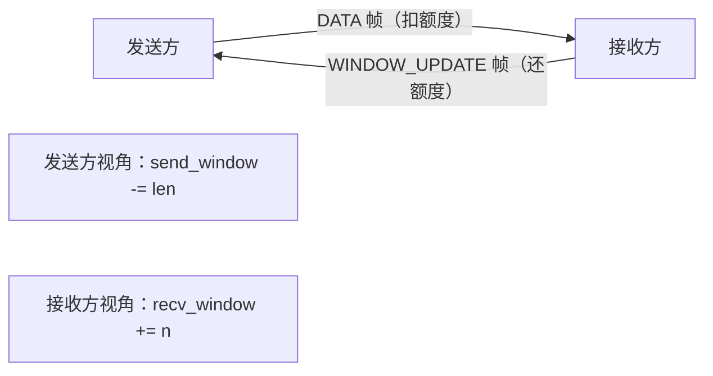
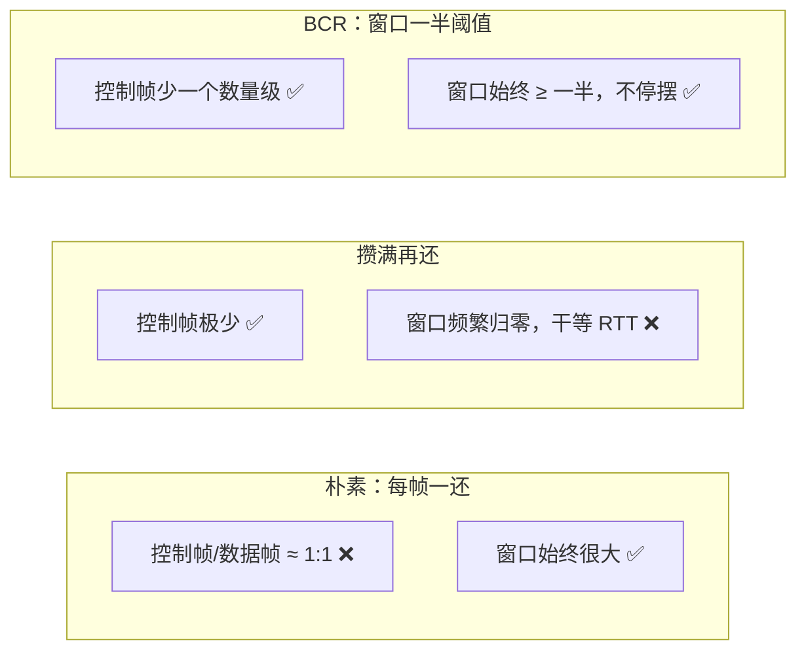

# 一个 WINDOW_UPDATE 的小问题：我数了一下控制帧，吓了一跳

## 事情是这样的

Courierust 的 HTTP/2 刚写完能跑通的时候，我做了个很无聊的事：**数控制帧**。

就是往代码里加了点统计，看看一个请求/响应往返里，除了数据帧之外，还发了多少 `WINDOW_UPDATE`、`SETTINGS` 之类的"管理帧"。

结果让我有点意外。

一个 1 MiB 的响应，按默认 16 KiB 一个数据帧来算，就是 64 个 DATA 帧。而我的流控实现，是**每收到一帧数据就回一个 `WINDOW_UPDATE`**——也就是说，这 64 个数据帧旁边，跟着 64 个控制帧。

**控制帧和数据帧 1:1。** 一半的帧都是"管理开销"，一字节业务数据都没带。

这还是在环回路径上（`127.0.0.1`），控制帧几乎零成本。要是放到真实网络、跨运营商、跨海的场景，这 64 个控制帧就是实打实的带宽和 RTT 开销。

我当时就想：这肯定能优化。

---

## 先搞懂：流控到底在干嘛

HTTP/2 的流控是**信用制**的，英文叫 credit-based。理解它，用个生活例子最好。

想象你和一个食堂签了个协议：

- 食堂（发送方）**先给你 65535 块钱的赊账额度**（这就是"流控窗口"）；
- 食堂每给你送一批货，就从额度里扣钱；
- 你收到货、把货卖出去（处理完）之后，要**把额度还给食堂**——还额度的动作，就是发一个 `WINDOW_UPDATE` 帧；
- 食堂看到你还了额度，才知道"哦，他又腾出空间了，可以继续发货"。

**如果额度用光了，食堂就停发。** 这就是背压（backpressure）——接收方处理不过来，发送方自然慢下来，谁也不会被压垮。

而且 HTTP/2 有**两级**额度：

- **连接级**（stream 0）：整条连接的在途总量不能超过这个数；
- **流级**（每个流单独）：单个流不能独占整条连接的额度。



---

## 问题出在"什么时候还"

还额度这件事，时机很重要。我最初的实现是教科书写法：**每收一帧就还一帧**。

用食堂的例子说就是：

> 食堂每送一箱货，你就给食堂打个电话："我又腾出 100 块的额度了，可以继续送。"

一天收 64 箱货，就打 64 个电话。**电话（控制帧）比货（数据帧）还多。** 这是纯浪费。

你可能会说：那把电话省了，等额度快用光再打一个不就行了？

**也不行。** 这里有个隐蔽的坑，是我后来才想明白的：

如果你一直不还额度，直到**额度归零**才打那个电话，会发生什么？

> 食堂收到你的电话，确认你腾出空间了，然后**重新发货**——这中间有一个完整的往返（RTT）。

在环回网络（`127.0.0.1`）上，这个 RTT 只有约 0.3ms，无所谓。但在**真实网络**上——比如跨洋，RTT 是 100ms 甚至更多——这意味着每次额度用光，发送方就要**干等 100ms** 才能继续发。吞吐直接掉一大截。

**省下了控制帧，却把吞吐绑死在了 RTT 上。** 这是捡了芝麻丢西瓜。

---

## 解法：攒一攒再还，但别攒到空

所以正确答案是：**攒一攒，但攒到"一半"就还**。

用送水工的例子讲最清楚：

- 你家有一个蓄水池（接收窗口），送水工（发送方）每次最多给你送两桶水（窗口大小），送完要等你说"我又喝掉了一桶"才继续送；
- **方案 A（每口一电话）**：你每喝一口就给送水工打一次电话。电话费比水费贵，疯了；
- **方案 B（全喝光再叫）**：你等两桶全喝光、渴到不行了才打电话。送水工送过来要时间（RTT），这段空窗期你一直渴着。在环回上没事，跨海就渴死了；
- **方案 C（剩一桶就预约）**：你喝掉一桶、池子里还剩一桶的时候，就给送水工打个电话："再送两桶。"送水工路上走的时间，你还有一桶水顶着，**永远不会断水**。

方案 C 就是 BCR（Batched Credit Reflow，批量信用回流）。**"剩一半就预约"就是"阈值 = 窗口一半"。**

我定这个阈值的逻辑很简单：

> 只要我在窗口还剩一半的时候就还信用，发送方的可用额度就**永远 ≥ 一半**。它永远不会被逼到"额度归零、干等 RTT"的境地。同时，信用是"攒批"还的，控制帧数量降了一个数量级。

---

## 代码长什么样

这是 `release_data` 的实现，加了注释，你可以直接对着看：

```rust
/// 把收到的数据信用批量还给对端（BCR）。
pub fn release_data(&mut self, stream_id: u32, n: usize) {
    let n = n as i64;

    // ---- 流级：攒到"初始窗口的一半"（下限 16 KiB）才还 ----
    let stream_release_threshold = (self.local.initial_window_size as i64 / 2).max(16 * 1024);
    let mut emit_stream = 0i64;
    if let Some(s) = self.streams.get_mut(&stream_id) {
        if s.recv_unreleased >= stream_release_threshold {
            emit_stream = s.recv_unreleased;      // 整批还
            s.recv_unreleased = 0;                 // 清空累积器
            s.recv_window = s
                .recv_window
                .saturating_add(emit_stream)
                .min(MAX_FLOW_WINDOW);
        }
    }
    if emit_stream > 0 {
        self.pending_frames.push_back(Frame::WindowUpdate {
            stream_id,
            increment: emit_stream.min(i64::from(u32::MAX)) as u32,
        });
    }

    // ---- 连接级：独立累积，攒到 32 KiB 才还 ----
    self.conn_pending_release += n;
    let conn_threshold = 32 * 1024i64;
    if self.conn_pending_release >= conn_threshold {
        let inc = self.conn_pending_release.min(i64::from(u32::MAX)) as u32;
        self.conn_pending_release = 0;
        self.conn_recv_window.release(inc as i64);
        self.pending_frames.push_back(Frame::WindowUpdate {
            stream_id: 0,
            increment: inc,
        });
    }
}
```

几个细节值得说：

**1. 为什么有两个累积器、两个阈值？**

因为 HTTP/2 有流级和连接级两个窗口。流级的阈值按"初始窗口的一半"算（跟窗口大小联动），连接级的阈值固定 32 KiB。两个累积器独立记账、独立触发，互不干扰。

**2. 为什么流级阈值用 `initial_window_size / 2`？**

因为流级窗口默认 65535，"一半"就是 32 KiB 左右。这个值跟着配置走——如果对端把初始窗口调大了，阈值自动跟着变大，不会出现"攒半天攒不够"的情况。下限 16 KiB 是防止窗口被配得太小导致阈值不切实际。

**3. 为什么用 `saturating_add` 和 `min`？**

窗口是 `i64` 记账（线值是 `u32`，`i64` 永远溢不出），回信用 `min(MAX_FLOW_WINDOW)` 封顶。这不是装饰——HTTP/2 规范（RFC 9113 §6.9.1）说窗口更新超上限就是 `FLOW_CONTROL_ERROR`，这是安全边界，批量化的同时**不能放松校验**。

窗口层还有一层保险，任何 `WINDOW_UPDATE` 想越过上限，直接判协议错误：

```rust
/// 加信用（来自 WINDOW_UPDATE）。超过上限返回 false → FLOW_CONTROL_ERROR
pub fn increase(&mut self, n: u32) -> bool {
    let next = self.size.saturating_add(n as i64);
    if next > self.limit { return false; }
    self.size = next;
    true
}
```

---

## 效果：控制帧降了一个数量级

还是那个 1 MiB 响应、16 KiB 一帧的例子：

| 实现 | 流级 WINDOW_UPDATE 数 |
|---|---|
| 朴素（每帧一还） | 64 |
| BCR（阈值 = 窗口一半） | 约 2–3 |

**64 个变成 2–3 个，一个数量级。** 而且因为阈值是"一半"，发送方的可用窗口始终 ≥ 一半，**吞吐完全不依赖"等一个 WINDOW_UPDATE 的 RTT"**——这是 BCR 和"攒满再还"最本质的区别：



---

## 一些实话

这个机制没什么高深数学，就是一个朴素的工程判断：

> **别每件小事都汇报（每帧一个 WINDOW_UPDATE），但也别等到火烧眉毛才汇报（攒到 0）——留一半缓冲，批量汇报。**

阈值选"一半"是启发式，不是最优解。可能"三分之二"或"四分之三"在某些负载下更好。但"**永远别让窗口归零**"这条原则是硬的，因为它直接决定发送方会不会被 RTT 卡死。

而且有意思的是，这个优化是在**已经正确的实现**上做的——流控的语义、溢出校验、安全边界全都保留了，只是把"还信用"这个动作从"每帧"改成了"攒批"。**优化一个已经正确的东西，比从零做对要难，但也更值钱**，因为你不用拿正确性去换性能。

---

*上一篇：[HTTP/2 的优先级：一个让大家都放弃的功能](./01-wucs-scheduler.md)*
*下一篇：[一个 5ms 的 P99 尖峰，逼我写了个"烧水壶哨子"](./03-self-pipe-event-scheduler.md)*
