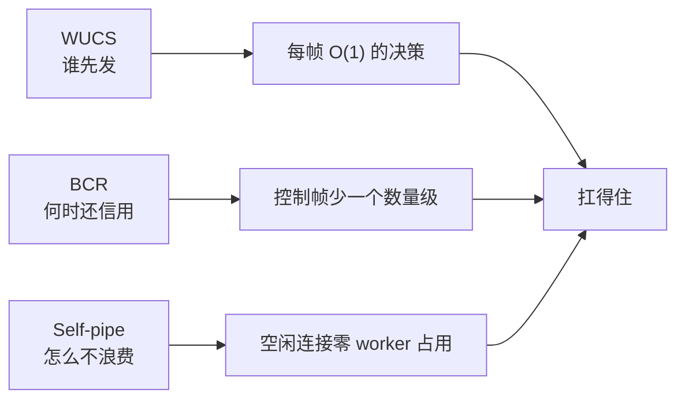

# Courierust 工程故事：三个"看不见"的设计

这个系列想讲三件事。它们都不产生任何用户可见的数据，但决定了你的 HTTP 栈**快不快、稳不稳、扛不扛得住**。

| 篇 | 主题 | 一句话 | 生活类比 |
|---|---|---|---|
| [01](./01-wucs-scheduler.md) | HTTP/2 优先级调度器 | 一个让大家都放弃的功能，我用 30 行代码做成了 O(1) | 医院急诊分诊：危重优先，但感冒病人也饿不死 |
| [02](./02-bcr-flow-control.md) | 批量信用回流 | 我数了一下控制帧，吓了一跳，然后砍掉了一个数量级 | 送水工：剩半桶水就预约，永远不断水 |
| [03](./03-self-pipe-event-scheduler.md) | 事件调度器 | 一个 5ms 的 P99 尖峰，逼我写了个"烧水壶哨子" | 餐厅前台：不每 5 分钟看一次铃，而是装个哨子 |

## 它们解决的是同一个问题的三个侧面

一条 HTTP 连接上，同时发生着三件事：**谁先发**（调度）、**什么时候还信用**（流控）、**空闲时怎么不浪费资源**（事件循环）。

- **WUCS** 回答：一堆流抢带宽，这一帧给谁？——高优先级优先，低优先级饿不死，每帧都付得起。
- **BCR** 回答：收到数据，什么时候把信用还给发送方？——攒批还，别攒到空。
- **Self-pipe** 回答：几千条空闲连接怎么不占资源？控制消息怎么不排队等 tick？——挂轮询器 + 一个能吵醒 poll 的哨子。

## 关于 Courierust

[Courierust](https://github.com/blueokanna/Courierust) 是一个零第三方依赖、`no_std + alloc` 可编译、全程无 `unsafe` 的 HTTP/1.1 + HTTP/2 + gRPC 协议栈，并自带从零实现的 TLS 1.2/1.3 与 QUIC v1 / HTTP/3。本系列讲的就是其中三个"不起眼但全是设计"的角落。
