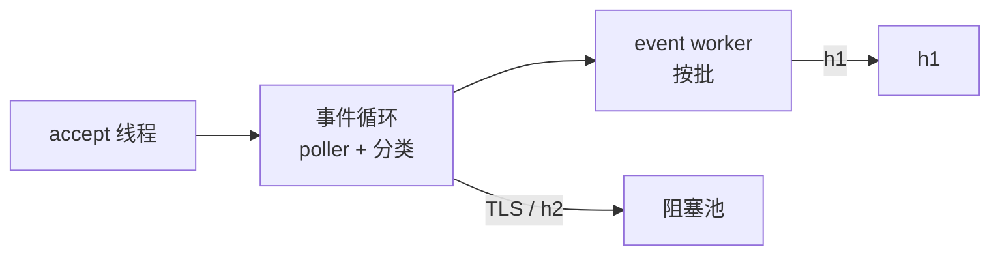

# courierust_server

HTTP 服务器，也是事件驱动调度器的家。默认情况下，空闲 / 半截 / 慢速连接挂在就绪轮询器上，**零 worker 占用**；就绪的连接按批派发给 event worker。TLS 和 HTTP/2 连接跑在阻塞的工作窃取池上。`ServerConfig::event_driven` 默认 `true`。

## 架构



- **Accept 线程**只 accept——从不读、从不 peek、从不睡、从不分类，慢客户端永远卡不住 accept 路径。
- **事件循环**把明文 HTTP 连接挂在 poller 上（Winsock `select` / POSIX `poll`），从前几个字节分类 TLS / h2 / h1，并回收 idle 连接。
- **Event worker** 跑一个增量请求解析器，能在上次停下的地方恢复——半截请求被挂回，而不是被握住。
- **TLS 和 HTTP/2** 走阻塞池，由 `handshake_timeout` / `h2_idle_timeout` / worker 数约束。

整个架构靠一个 **self-pipe** 串起来——一对回环 socket，读端注册进 poller，让入队的控制消息*入队的瞬间*就打断阻塞的 poll。poll 超时永远不会进请求延迟路径。完整故事，连同催生它的 5ms P99 尖峰，在 `blogs/03-self-pipe-event-scheduler.md`。

## 关闭顺序不变量（为什么不会因为一个连接结束而全体停摆）

等待集合里出现一个已关闭的描述符不是”无害的过期项“：POSIX `poll` 只为该项返回 `POLLNVAL`，但 Winsock 的 `select` 会让**整个等待**以 `WSAENOTSOCK` 失败。因此：

- 连接结束时，worker 把 socket 句柄交给事件循环（`EventMsg::Closed { id, socket }`）。事件循环**先**从 poller 注销该 id，**然后**才放下句柄——描述符在被等待时永远仍然有效，*“停止监视”严格早于“关闭”*。
- 所有在事件循环内部关闭的连接（idle 回收、分类失败、派发失败的丢弃）都先 `unregister` 再 drop，顺序相同。
- 即使如此，等待仍然可能失败（fd 被复用、外部关闭等等）。此时事件循环不会空转：它按注册表（`pending` / h1 注册表 / WS 注册表）**重建**整个等待集合，让 fd 已死的项彻底消失；若重建后仍连续失败，则退避 1ms 一次，并计入 `Stats::event_wait_errors`——该计数在健康运行中永远为 0。

## worker 介入之前的防护

- 不完整的请求挂在 poller 上（零 worker）。
- 流式响应体在块与块之间同样挂着：生产者一停，worker 立刻返回，生产者的 `send` 自己唤醒 reactor（没有唤醒句柄的裸 `Body::Channel` 则转为轮询）。等下一块不再占着 worker。
- 对 `Connection: close` 请求的流式响应会完整写完再关连接。
- 超过 `idle_timeout` 没动静的连接被回收。
- `max_connections` 直接封顶驻留连接数。
- keep-alive / SSE / slow-loris 羊群耗不干池——并发基准证明了：200 条空闲半开连接 + 2 个 worker 仍能 ~300µs 内服务一次探测，而旧的"一连接一池任务"模型直接整体阻塞。

## 边界

- 事件路径服务 HTTP/1.1。TLS 和 h2 按设计走阻塞池。
- `event_driven: false` 恢复旧模型——每连接一个池任务——供对比与调试。不建议生产用：空闲/慢速羊群会耗尽池。
- 长时间阻塞的同步 handler 会占住一个 worker（事件驱动与否都一样）——任何同步服务器的通病。流式请用 channel body：等下一块时挂起的是连接，不是 worker。
- 同时服务 h2c 前导知识和 `h2c` Upgrade。
- **客户端证书（mTLS）**——`TlsSettings::client_auth` 接收 `ClientAuth`（client-auth 信任根 + `required`/`optional`），配置后本服务端会向每个客户端索取证书：按信任根、有效期与 `clientAuth` EKU 校验，并由 `CertificateVerify` 证明持有私钥。要求认证而客户端拒绝时，应答 `certificate_required` (116)。两条边界是被**强制执行**而不是写在文档里：`client_auth` 与 TLS 1.2 的组合在握手建立时被拒绝；`client_auth` + `http3` 在启动时被拒绝——这里的 mTLS 指 TLS 1.3 over TCP。

## 嵌入：谁来拥有 accept 循环

两个入口，同一个引擎：

- `Server` 负责 bind——或者用 `Server::from_listener` 接管你已经绑好的
  listener（先 bind 再降权的进程、systemd socket 激活、多个服务共享的
  端口）——并由它自己跑调度器。
- `courierust_server::serve_connection(stream, handler, config)` 驱动
  **一条**已接受的连接：TLS 握手、ALPN、HTTP/1.1 / HTTP/2、WebSocket
  升级、隧道。这正是代理需要的形状——socket（以及它的 `peer_addr`）
  在引擎看到之前就在你手里，所以按连接生效的策略（地址白名单、限速、
  自己的计数统计）留在你这边，协议工作留给引擎。socket 的配置与
  `Server` 完全一致：`TCP_NODELAY`，TLS 握手期间用
  `handshake_timeout`，之后切到 `read_timeout`。

有两条边界需要知道：`serve_connection` 会拒绝带 `http3` 的配置——QUIC
属于服务器自己的 UDP reactor，只有 `Server::serve*` 拥有它，悄悄只服务
TCP 等于半套服务；另外，identity 为空的 TLS 配置会在创建服务器或发起
连接的任何入口被拒绝，在启动时而不是每个客户端来一次。

## WebSocket 升级

handler 拥有 WebSocket 路由的方式跟拥有 HTTP 路由完全一样：`Handler::websocket(&self, req) -> WsUpgradeReply` 对自己服务的路径返回 `Accept(service)`，其余返回 `Pass`，于是明文 HTTP 与 WebSocket 共用同一个端口、同一个 handler。

升级是**原地的，两条驱动路径都支持**：

- **阻塞驱动**（`event_driven: false`）——`courierust_server::ws::serve_blocking` 用阻塞循环驱动连接，只在等待下一帧时才 armed socket 读超时（Windows 会对每次阻塞操作收费，写也包括在内）。
- **事件驱动**（默认）——HTTP 连接变成 `WsEventConn` 留在 reactor 里：只在 socket 可读时读帧，只在可写时冲刷应用层入队的发送，于是一个空闲 WebSocket 只占**一个 poller 槽位，不占线程**。服务回调跑在 event worker 上；从其他线程扇出走 `WsConn::sender()`（`WsSender`），它是入队 + 唤醒 reactor，而不是阻塞 reactor。

`WsConfig`（Origin 策略、子协议、帧/消息/分片上限、有界发送队列、Ping/Pong 保活、`trusted_proxies`）两条驱动共用，所以策略绝不会因为跑在哪条路径上而不同——`tests/ws.rs` 也是把同样的场景在两条路径上各跑一遍。引擎本身与其协议级保证见 [`courierust_ws`](../courierust_ws/README_CN.md)。

## H1 每请求阶段计时

`COURIERUST_H1_TRACE=1` 开启每请求分段计时，输出 `H1SEG|...` 行——一条连接建立行（`event=newconn|accept_us`），以及每个已服务请求批一条行，覆盖 1 KiB keep-alive 请求的完整九段分解：

```
accept_us    accept → 注册进 poller                      （连接建立）
fresh_wait_us 注册 → 首次 worker 拾取                    （仅首请求）
handoff_us   release → 下次拾取（keep-alive 往返         = last_write_to_reregistered
             + poll_ready_to_worker_dispatch）
dispatch_us  worker 拾取 → 读到第一个字节
parse_us     第一个字节 → 请求完整
handler_us   头完整 → 响应就绪
build_us     响应 → 首次写入（序列化）
write_us     首次写入 → 全部写完
```

输出刻意保持裸 `key=value`，方便脚本/基准分桶。环回上主导项是 `handoff_us` 和 `write_us`——reactor 往返和 socket 写入——而 `parse_us` / `handler_us` 是个位微秒。这直接回答"时间到底花在 parser 还是 handoff"。全部由环境变量门控；不设置时热路径不付任何 `Instant::now()` 成本。

## 用法

```rust
use courierust::courierust_server::{Server, ServerConfig};
use courierust::courierust_http::{Request, Response};

let mut cfg = ServerConfig::default();
cfg.http2 = true; // 同端口 h2c + h1.1
let server = Server::bind_with_config("127.0.0.1:8080", cfg)?;

server.serve(|req: Request<Body>| -> Response<Body> {
    Response::with_status(200.into())
})?;
```

给 `ServerConfig::tls` 配上 `Identity` + ALPN，同一个服务器就说 HTTPS——见 `examples/https.rs`。
