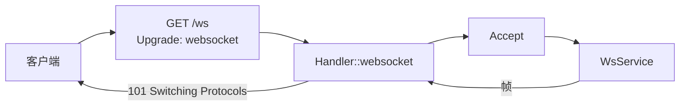

# WebSocket 使用指南

Courierust 自带一套完整的 RFC 6455 WebSocket 实现（`courierust_ws`）
以及 RFC 7692 `permessage-deflate`，并且直接接进你已经在用的服务端与
客户端。一个 WebSocket **就是**一条 HTTP/1.1 连接就地升级而来：它与明文
HTTP 共用端口、共用 handler、共用 TLS 栈、共用事件调度器——不需要第二个
监听端口、不需要第三方依赖、也不需要另一个运行时。



## 服务端钩子

`Handler::websocket` 决定哪些路由按 WebSocket 服务；返回 `Pass` 就回到
普通 HTTP 路径（于是 `/ws` 归你，其它路径仍然由你真正的 handler 回答）：

```rust
use courierust::courierust_body::Body;
use courierust::courierust_http::request::Request;
use courierust::courierust_http::response::Response;
use courierust::courierust_server::ws::{WsConn, WsData, WsService, WsUpgradeReply};
use courierust::courierust_server::{Handler, Server, ServerConfig};
use std::sync::Arc;

struct Echo;

impl WsService for Echo {
    fn on_message(&self, conn: &mut WsConn, msg: WsData) {
        match msg {
            WsData::Text(t) => { let _ = conn.send_text(&t); }
            WsData::Binary(b) => { let _ = conn.send_binary(&b); }
        }
    }

    fn on_close(&self, conn: &mut WsConn, code: Option<u16>, clean: bool) {
        eprintln!("closed code={code:?} clean={clean} path={}", conn.path());
    }
}

struct App;

impl Handler for App {
    fn handle(&self, _req: Request<Body>) -> Response<Body> {
        Response::text("普通 HTTP 照样能用")
    }

    fn websocket(&self, req: &Request<Body>) -> WsUpgradeReply {
        if req.path == "/ws" {
            WsUpgradeReply::Accept(Arc::new(Echo))
        } else {
            WsUpgradeReply::Pass
        }
    }
}

let server = Server::bind_with_config("127.0.0.1:8080", ServerConfig::default())?;
server.serve(App)?;
```

`WsService` 提供 `on_open`、`on_message`、`on_pong`、`on_idle` 与
`on_close`；每连接的应用状态挂在连接本身上
（`conn.set_state(...)` / `conn.with_state(...)`），所以不需要给每条连接
造一个 `WsService` 对象。

### 两条驱动路径都支持就地升级

用 `ServerConfig::event_driven` 选择调度器，WebSocket 在两条路径上都能
工作，而且策略完全一致——因为跑的是同一套 `courierust_ws` 引擎：

| | 阻塞驱动（`event_driven: false`） | 事件驱动（默认） |
|---|---|---|
| 驱动循环 | 在连接自己的线程上阻塞读写 | 留在 reactor：可读才读，可写才冲刷 |
| 空闲 WebSocket 的成本 | 一个池 worker | **一个 poller 槽位** |
| 保活 | 只在等下一帧时 armed 读超时 | `ping_interval` 的 Ping/Pong |
| 其他线程扇出 | `WsConn::sender()` | `WsConn::sender()` |

reactor 里值得知道的一点：空闲的 WebSocket **不占 worker**，所以一个
「几千条基本空闲连接」的服务受 `max_connections` 约束，而不是受 worker
数约束。代价是服务回调跑在 event worker 上——在 `on_message` 里推几千条
消息会把本该负责冲刷的 reactor 堵死。受支持的扇出方式是任意线程调用
`WsConn::sender()`：它只负责入队并唤醒 reactor。

## 策略：`WsConfig`

```rust
use courierust::courierust_server::ws::{PmDeflatePolicy, WsConfig};
use courierust::courierust_ws::OriginPolicy;

let ws = WsConfig {
    // 默认值：浏览器只能从同站点打开这个 socket，
    // 因为浏览器会把会话 Cookie 一起带上升级请求。
    origin: OriginPolicy::SameOrigin,
    // 只信任你的代理发来的 X-Forwarded-For / X-Forwarded-Proto。
    trusted_proxies: vec![],
    subprotocols: vec!["chat.v2".into(), "chat.v1".into()],
    compression: PmDeflatePolicy::default(),
    max_frame: 16 * 1024 * 1024,
    max_message: 16 * 1024 * 1024,
    max_fragments: 0,          // 0 = 不限制
    max_send_queue: 4 * 1024 * 1024,
    read_buffer: 64 * 1024,
    ping_interval: Some(std::time::Duration::from_secs(30)),
    close_timeout: Some(std::time::Duration::from_secs(5)),
    ..Default::default()
};
```

| 配置项 | 它为什么存在 |
|---|---|
| `origin` | 默认 `SameOrigin` 挡住「其他站点页面 → 已认证 socket」；非浏览器客户端用 `NoOrigin`，白名单用 `List`，明确放弃才用 `Any` |
| `trusted_proxies` | 只有这些对端可以用 `X-Forwarded-For` / `X-Forwarded-Proto` 覆盖客户端地址 |
| `subprotocols` | 服务端偏好顺序，客户端 offer 里第一个命中的胜出 |
| `compression` | `permessage-deflate` 策略（体积阈值、窗口位数） |
| `max_frame` / `max_message` / `max_fragments` | 对端无法用「声明的大小」换内存；违规得到 1009/1007/1002 |
| `max_send_queue` | 应用推得比对端读得快时，用它封顶内存 |
| `read_buffer` | 64 KiB 适合媒体类流量，16 KiB 适合大量基本空闲的连接 |
| `ping_interval` | 入向静默这么久就 Ping，两倍时长还没动静就放弃连接 |
| `close_timeout` | 我们发起关闭握手后，等对端回 Close 的时长 |

## 客户端

```rust
use courierust::courierust_client::ClientConfig;
use courierust::courierust_client::ws::WebSocket;

let cfg = ClientConfig::default();          // 默认 60 s 读超时

let mut ws = WebSocket::connect("wss://example.com/ws", &cfg)?;  // TLS 在本 crate 内
ws.send_text("hello")?;
ws.send_binary(&[0u8, 1, 2, 255])?;

loop {
    match ws.read_message()? {
        courierust::courierust_ws::Event::Text(t) => println!("text {t}"),
        courierust::courierust_ws::Event::Binary(b) => println!("binary {} bytes", b.len()),
        courierust::courierust_ws::Event::Ping(_) | courierust::courierust_ws::Event::Pong(_) => continue,
        courierust::courierust_ws::Event::Close(frame) => {
            println!("closed {frame:?}");
            break;
        }
    }
}
ws.close(1000, "done")?;
```

客户端同时支持 `ws://` 与 `wss://`（后者走本 crate 自带的 TLS 1.2/1.3
栈），子协议协商与服务端共用同一套实现，并且自带读超时。
`cargo run --example ws_client` 是它的生产级版本（可连公共 echo 服务或你
自己的端点）；`cargo run --example ws_echo` 则在一个进程里同时跑服务端与
客户端。

## 替你强制的规则

| 规则 | 行为 |
|---|---|
| 掩码方向（§5.1） | 服务端拒绝未掩码的客户端帧；客户端拒绝被掩码的服务端帧 |
| 控制帧 | 不可分片，长度不超过 125 字节 |
| 长度编码 | 只接受最短长度编码 |
| 文本帧 UTF-8 | 增量校验，在破坏处精确返回 1007 |
| RSV 位 | 未协商即拒绝 |
| 关闭码 | 按每个方向的合法集合校验 |
| §5.5.1（Close 之后不得再发帧） | 连接级共享标志，竞态的发送以 `ErrorKind::Canceled` 被拒 |
| 各类上限 | 字节进缓冲之前就以 1009 失败，`permessage-deflate` 解压炸弹同样 |
| 握手 | 恰好一个规范 `Sec-WebSocket-Key`、`Version: 13`、按 token 列表匹配的 `Connection: Upgrade`、HTTP/1.1 必须有 `Host` |
| 掩码密钥 | 平台熵播种的 ChaCha20 流，每帧一个 |

## 反向代理部署（推荐做法）

在 nginx / Traefik 处终结 TLS（顺带也能终结 HTTP/2、HTTP/3），把升级请求
转发到你的明文监听：

```nginx
location /ws/ {
    proxy_pass http://127.0.0.1:8080;
    proxy_http_version 1.1;
    proxy_set_header Upgrade $http_upgrade;
    proxy_set_header Connection "upgrade";
    proxy_set_header X-Forwarded-For $proxy_add_x_forwarded_for;
    proxy_set_header X-Forwarded-Proto $scheme;
    proxy_buffering off;             # 缓冲帧会毁掉延迟
    proxy_read_timeout 3600s;        # 必须大于 ping_interval
    proxy_send_timeout 3600s;
}
```

然后告诉服务端它「身后有代理」：

```rust
let ws = WsConfig {
    origin: OriginPolicy::List(vec!["https://app.example.com".into()]),
    trusted_proxies: vec![IpNet::parse("127.0.0.1/32")?, IpNet::parse("10.0.0.0/8")?],
    ..Default::default()
};
```

两个足够常见的错误值得点名：`proxy_read_timeout` **小于**
`ping_interval` 会掐掉健康的空闲 socket；而 `trusted_proxies` 留空、应用
却又去读 `X-Forwarded-For`，等于在信任客户端自己发的内容。

## 诚实说明

- **未实现 RFC 8441（WebSocket over HTTP/2）。** 客户端在 ALPN 中**只**提供
  `http/1.1`——即使 `ClientConfig::http2` 为 `true`——且如果连接最终落在 h2 上，
  会在读到任何一帧之前拒绝。服务器侧：在**已建立的** h2 连接上尝试 WebSocket
  属于畸形消息，按 RFC 9113 §8.1.1 作为**流级错误（`PROTOCOL_ERROR`）**拒绝，
  两种形式都如此——RFC 8441 的扩展 CONNECT（`:method = CONNECT` 配
  `:protocol = websocket`，在本栈里是未定义伪首部，正是 RFC 8441 §3 为
  「对端从未声明 `SETTINGS_ENABLE_CONNECT_PROTOCOL`」定义的拒绝方式），
  以及 HTTP/1.1 式的 `Upgrade: websocket` / `Connection: Upgrade`（§8.2.2）。
  连接与其它流保持可用。WebSocket 请用 HTTP/1.1 承载；这三句话背后的测试是
  `h2_rejects_rfc8441_extended_connect_as_stream_error`、
  `h2_rejects_websocket_upgrade_header_over_h2` 与
  `wss_negotiates_http_1_1_against_an_h2_capable_server`。
- **`permessage-deflate` 对每条消息独立压缩**（不做上下文接管）。这永远
  合法，消除了「某条消息的明文泄漏进另一条消息」那类缺陷，也是服务端能
  在不为每条连接保留 32 KiB 滑动窗口的前提下承载数千连接的原因；代价是
  大量微小重复消息上压缩率有上限损失。
- **Windows 上 socket 超时不是免费的。** 阻塞驱动只在空闲等待时 armed
  读超时；客户端若一直带着 `read_timeout`，256 KiB 批量推送大约**慢 2
  倍**——批量传输请设 `read_timeout: None`，改用应用层存活判断。实测见
  [基准测试](基准测试)。
- **本 crate 两端之间传 256 KiB 消息**比 tungstenite 的组合慢（原因已定
  位，其中就包含上面这条 socket 超时发现）；小消息与中等消息为持平或领
  先。基准文档两个方向都如实报告。

## 覆盖范围在哪

- **27 个端到端测试**（`tests/ws.rs`）：真实客户端 × 真实服务端 × 真实
  socket，**两条驱动路径都跑**——握手（含 RFC 6455 accept-key 官方向量）、
  双向掩码、带交错控制帧的分片重组、RFC 7692 协商与互操作、UTF-8 失败
  码、关闭握手的干净性、本 crate TLS 上的 `wss://`、其他线程推送、
  Origin/子协议策略、各类上限，以及 reactor 回归（一条连接关闭后，仍打开
  的连接必须继续被服务）。
- **示例**：`cargo run --example ws_echo`、`cargo run --example ws_client`。
- **引擎内部、部署配方与完整安全姿态**：`src/courierust_ws/README_CN.md`。
- **与 `tungstenite` / `tokio-tungstenite` 的对比**：
  `benches/WS_BENCHMARK.md`——代码、方法论与诚实的行都在里面。
